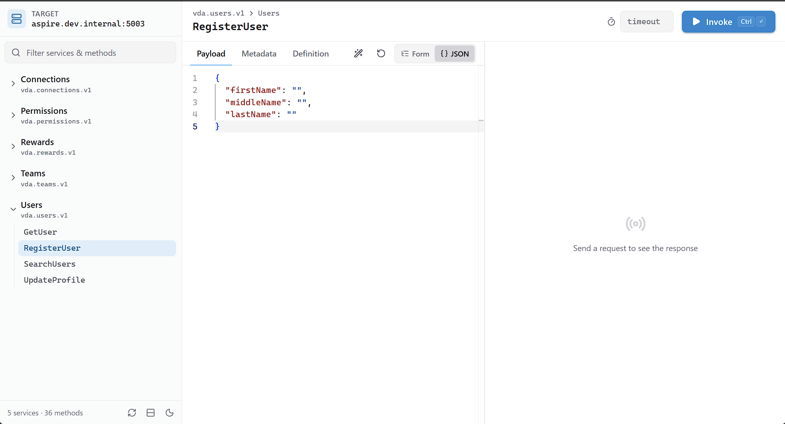
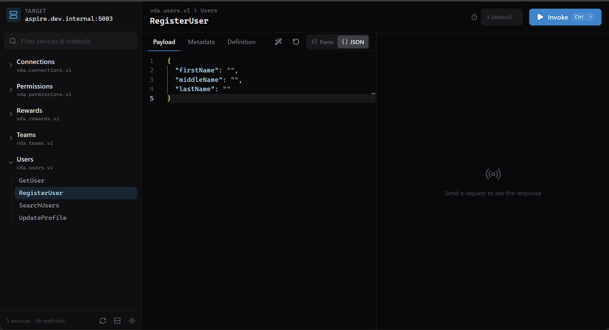
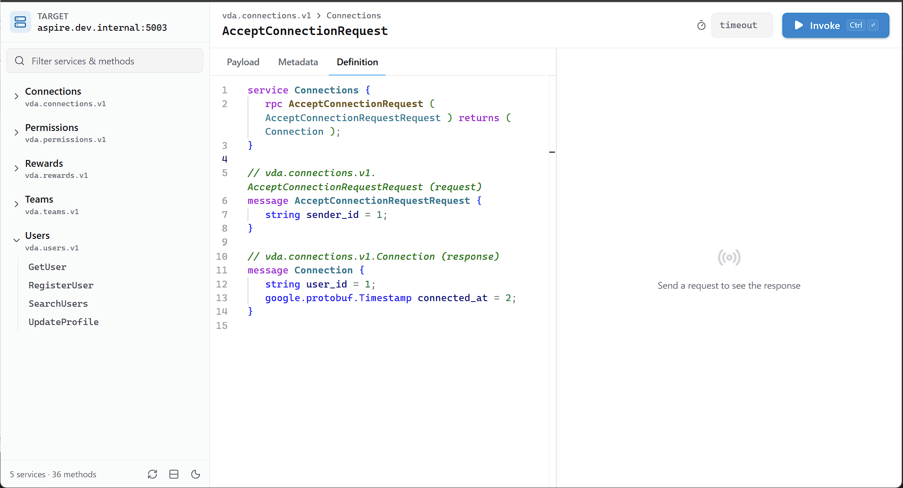
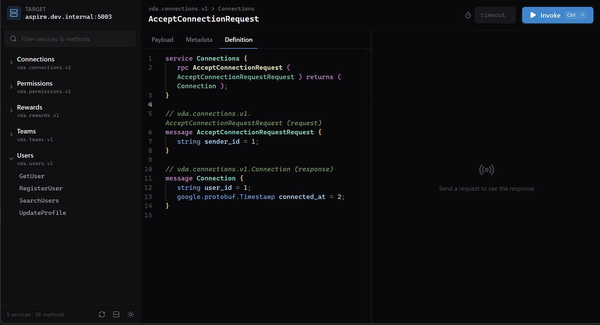

# grpcui-modern

> **Note:** This is an unofficial, vibe-coded fork of
> [fullstorydev/grpcui](https://github.com/fullstorydev/grpcui) with a
> modernized user interface. All credit for the original project goes to its
> authors. If you want the official, battle-tested tool, use the original.

A modern web UI for gRPC servers: a React/Monaco frontend on top of the
reflection and invocation handlers from
[fullstorydev/grpcui](https://github.com/fullstorydev/grpcui) (`./grpcui-old`).
It ships as a single static binary and a ~25 MB `scratch` image. Image, binary
path, port, and flags all match `fullstorydev/grpcui`, so it can replace that
image directly.

- `frontend/`: the React SPA (Vite, Tailwind v4, Monaco)
- `*.go`: the gateway (`main.go` flags, `connect.go` discovery, `api.go` JSON API, `web.go` embedded SPA)
- `docs/API.md`: the backend ⇄ frontend contract

## Screenshots

Edit the request payload as JSON or with a form:

| Light | Dark |
|---|---|
|  |  |

View the method's proto definition, including request and response messages:

| Light | Dark |
|---|---|
|  |  |

## Docker image

A prebuilt image is published on Docker Hub:
[asgerveng/grpcui-modern](https://hub.docker.com/r/asgerveng/grpcui-modern).

```sh
docker run --rm -p 8080:8080 asgerveng/grpcui-modern -plaintext host.docker.internal:5001
```

## Build & run

To build the image from source:

```sh
docker build -t grpcui-modern .
docker run --rm -p 8080:8080 grpcui-modern -plaintext host.docker.internal:5001
```

Local development (two terminals):

```sh
cd frontend && npm ci && npm run build   # go:embed needs frontend/dist
go run . -plaintext localhost:5001        # UI + API on :8080
cd frontend && npm run dev                # optional: Vite dev server proxying /api to :8080
```

Run the Go tests with `go test .` (not `./...`: `frontend/node_modules`
contains a stray `.go` file).

## Configuration

All upstream `grpcui` flags work (`-plaintext`, `-insecure`, `-cacert`, `-cert`/`-key`,
`-H`, `-rpc-header`, `-reflect-header`, `-default-header`, `-protoset`, `-proto`,
`-service`, `-method`, `-examples`, `-max-time`, `-base-path`, …). In addition:

| Setting | How |
|---|---|
| Target | positional arg, or `GRPCUI_TARGET`. `host:port`, or an `http://`/`https://` URL (`http://` implies `-plaintext`) |
| Any flag | `GRPCUI_<FLAG>`, e.g. `GRPCUI_PLAINTEXT=true`, `GRPCUI_RPC_HEADER="authorization: Bearer x"` (newline-separate repeated values) |
| Listen port | `-port`, else `$PORT`, else `8080` |
| Health | `GET /healthz`: `200` once the schema is discovered, `503` before |

The UI starts immediately and keeps retrying schema discovery until the target
is reachable. Use the ⟳ button in the sidebar to re-discover after the target
is redeployed with new protos.

## .NET Aspire

In the AppHost, either build the image from source with `AddDockerfile`, or
use a pushed image with `AddContainer`:

```csharp
var builder = DistributedApplication.CreateBuilder(args);

var ordersApi = builder.AddProject<Projects.Orders_Api>("orders-api");

builder.AddDockerfile("grpcui", "../grpcui-modern")   // or: .AddContainer("grpcui", "asgerveng/grpcui-modern", "latest")
    .WithHttpEndpoint(targetPort: 8080, name: "http")
    .WithHttpHealthCheck("/healthz")
    .WithArgs(ctx =>
    {
        // Aspire resolves the endpoint to an address the container can
        // reach, e.g. "http://host.docker.internal:5123" for a project on the
        // host. grpcui-modern accepts the URL form; http:// implies -plaintext.
        ctx.Args.Add(ordersApi.GetEndpoint("http"));
    })
    .WithParentRelationship(ordersApi);

builder.Build().Run();
```

Notes:

- **Plaintext needs HTTP/2-only.** Over plain HTTP, gRPC requires the endpoint
  to speak HTTP/2 without TLS. The ASP.NET Core gRPC template's `appsettings.json` does this
  (`"Kestrel": { "EndpointDefaults": { "Protocols": "Http2" } }`). If your
  service keeps the default `Http1AndHttp2`, target the `https` endpoint
  instead and skip certificate checks (the dev cert isn't trusted inside the
  container and is issued for `localhost`):

  ```csharp
  .WithArgs(ctx =>
  {
      ctx.Args.Add("-insecure");
      ctx.Args.Add(ordersApi.GetEndpoint("https"));
  })
  ```

- **Environment variables work too**, if you prefer them to args:
  `.WithEnvironment("GRPCUI_TARGET", ordersApi.GetEndpoint("http"))`, plus e.g.
  `.WithEnvironment("GRPCUI_RPC_HEADER", "authorization: Bearer dev-token")`.
- **`WaitFor(ordersApi)` is optional.** The UI shows a "Connecting…" screen and
  becomes healthy as soon as the target answers reflection, so leaving it out
  lets the dashboard link work immediately.
- **The target must have gRPC reflection enabled.** In ASP.NET Core:
  `builder.Services.AddGrpcReflection();` and `app.MapGrpcReflectionService();`.
  Otherwise mount proto files into the container and pass `-proto`/`-import-path`
  or `-protoset`.
- **Migrating from `fullstorydev/grpcui`:** swap the image name. Existing
  `.WithArgs("-plaintext", "host:port")` and `.WithHttpEndpoint(targetPort: 8080)`
  keep working. The legacy-UI-only `-extra-js`, `-extra-css`, `-also-serve` and
  `-debug-client` flags are accepted and ignored.
